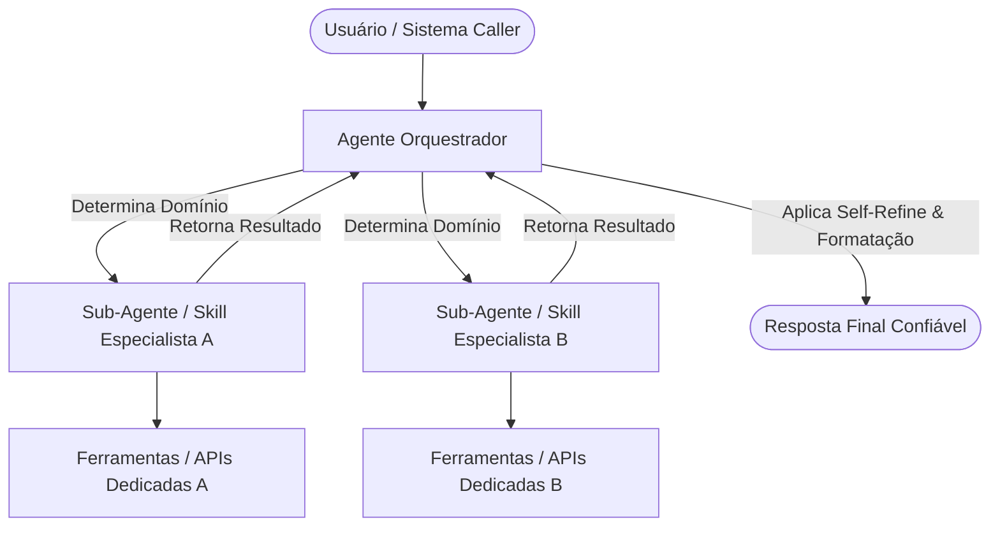

# Skill: Aprimoramento e Expansibilidade de Agentes e Skills

## Gatilhos de Ativação
- Necessidade de refatorar prompts genéricos ou extensos em procedimentos operacionais repetíveis (`SKILL.md`).
- Migração de sistemas simples de chat para arquiteturas baseadas em SDKs modulares (Google ADK, LangGraph, OpenAI Agents SDK, PydanticAI).
- Ocorrência de alucinações de ferramentas, estouro de limite de contexto (*context window*) ou respostas superficiais em fluxos de trabalho complexos.
- Solicitações para estruturar colaboração multi-agente (Orquestrador, Especialistas e Sub-agentes assíncronos).

## Entradas Obrigatórias
1. **Definição Atual do Agente ou Skill:** O código, arquivo `.md` ou instrução atual a ser expandida.
2. **Objetivo do Aprimoramento:** Ex: Inclusão de novas ferramentas, redução de custos/tokens, transição para multi-agente, ou aumento de precisão cirúrgica.
3. **Ambiente / Framework Alvo:** Ex: Google ADK (Python/Go/Node), LangGraph, OpenAI Agents SDK, ou arquivo `SKILL.md` puramente descritivo para LLMs nativos.

---

## Fluxo Passo a Passo com Decisões Condicionais

### Passo 1: Análise de Intenção e Auditoria de Contexto
- Examine o agente/skill atual. Identifique instruções vagas, falta de restrições negativas, e acoplamento excessivo de funções no mesmo prompt.
- **Regra de Decisão:** SE a instrução ultrapassar 1.500 tokens de regras estáticas, OBRIGATORIAMENTE segregue o conhecimento em arquivos secundários de referência ou sub-skills carregadas sob demanda.

### Passo 2: Seleção e Arquitetura do Modelo de Expansão
Avalie a complexidade do problema e escolha o padrão arquitetural:
- **Padrão A (Single-Agent com Injeção Dinâmica de Habilidades):** Indicado para fluxos onde o agente atua sozinho, mas precisa de "guias de procedimentos" específicos em fases pontuais do atendimento.
- **Padrão B (Orquestração Multi-Agente / Swarm):** Indicado para fluxos com múltiplos domínios de conhecimento (ex: Pesquisa + Redação + Validação de Código), onde cada sub-agente possui escopo e ferramentas dedicadas.

### Passo 3: Engenharia de Contexto e Formatação Estruturada
- Aplique o formato **CLAREZA** nas instruções do sistema (*System Instructions*):
  - **[C] Contexto e Persona:** Definição clara do papel e escopo do especialista.
  - **[L] Leitor / Nível Técnico:** Audiência da saída do agente.
  - **[A] Ação Principal:** Protocolo claro de passos.
  - **[R] Referências e Ferramentas:** Mapeamento de APIs e schemas tipados.
  - **[E] Estrutura da Saída:** Formato rigoroso (JSON, Markdown executivo, Pydantic Schema).
  - **[Z] Zonas de Risco:** O que o agente NUNCA deve fazer ou assumir.
  - **[A] Avaliação de Qualidade:** Critérios formais para considerar a tarefa concluída.

### Passo 4: Implementação do Loop de Raciocínio e Resiliência (ReAct / Self-Refine)
- Injete no agente uma diretiva explícita de verificação metacognitiva antes da resposta final:
  1. *Ação:* Executar ferramenta ou gerar raciocínio intermediário.
  2. *Observação:* Avaliar os dados retornados.
  3. *Self-Refine (Auto-Crítica):* Identificar 3 potenciais falhas ou omissões no rascunho.
  4. *Ajuste:* Corrigir a saída antes da exibição final.

### Passo 5: Tipagem Estrita de Ferramentas e Tratamento de Erros
- Garanta que toda integração de ferramenta (*Tool Calling*) contenha:
  - Descrições explícitas do uso e parâmetros obrigatórios vs. opcionais.
  - Tratamento de exceção: Instrução explícita de como agir se a ferramenta falhar ou retornar dados vazios (evitando alucinações de dados fictícios).

---

## Decisões Condicionais de Implementação

- **SE o objetivo for puramente descritivo (Prompt/Skill em Markdown):**
  - Gere um arquivo `SKILL.md` autônomo contendo metadados de gatilhos (*triggers*), modelo de dados e exemplos de poucos disparos (*few-shot examples*).
- **SE o objetivo for implementação em Código (ex: Google ADK / Python):**
  - Escreva o código modularizando:
    1. Arquivo de declaração de ferramentas (`tools.py`).
    2. Arquivo de definição de sub-agentes especialistas (`agents.py`).
    3. Arquivo orquestrador principal de loop (`main.py`).

---

## Modelo de Saída

### 1. Diagnóstico do Sistema Legado
* **Pontos Fracos Identificados:** [Lista de gargalos de contexto, ambiguidade ou vulnerabilidades]
* **Arquitetura Escolhida:** [Single-Agent + Skills OU Multi-Agente Swarm]
* **Justificativa de Design:** [Explicação da escolha baseada na redução de latência e ganho de precisão]

### 2. Diagrama de Orquestração (Mermaid)



### 3. Código do Componente Refatorado (`SKILL.md` ou Código de Produção)

```text
[Inserir o arquivo SKILL.md completo ou os blocos de código tipados em Python/ADK]
```

### 4. Checklist de Qualidade e Segurança

* [ ] As ferramentas possuem tipos e descrições não ambíguas?
* [ ] O limite de contexto foi preservado através da separação de responsabilidades?
* [ ] O agente sabe como reagir caso uma ferramenta retorne um erro ou resultado nulo?
* [ ] Foram incluídos guardrails contra vazamento de credenciais e ações destrutivas sem confirmação?
* [ ] A saída está formatada estritamente conforme o contrato estipulado?

## Limites de Segurança

* **Segurança Médica/Legal:** Agentes expandidos nestes domínios devem exigir anonimização de dados pessoais (LGPD/HIPAA) e incluir aviso explícito sobre a necessidade de supervisão profissional.
* **Execução de Código:** Agentes que utilizam sandboxes para execução de scripts (Python/Bash) devem rodar em ambientes isolados com tempo limite (*timeout*) estrito e sem acesso irrestrito à rede interna.
* **Validação de Permissões:** O agente orquestrador não pode conceder a um sub-agente permissões superiores às suas próprias autorizações originais.
