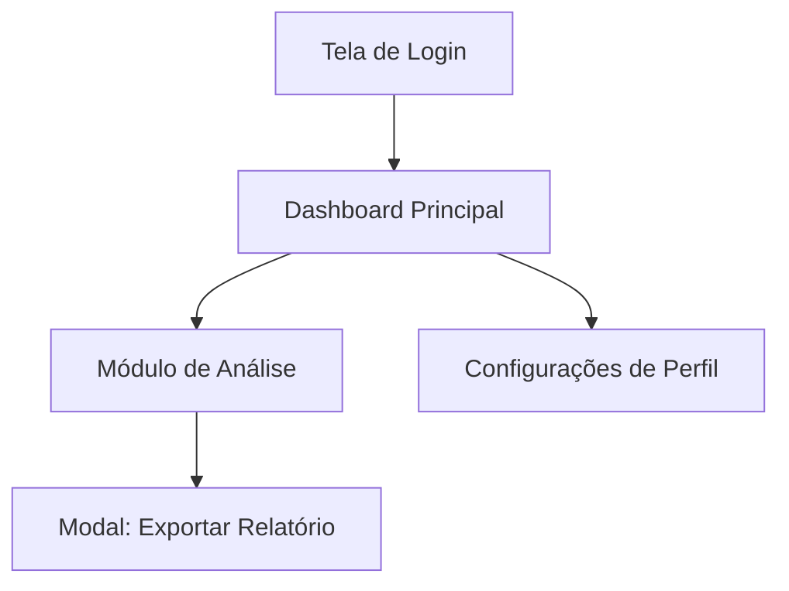

# Skill: Análise, Design e Implementação de Sistemas

## Gatilhos de Ativação
- Solicitações de arquitetura de software, aplicativos ou plataformas web.
- Pedidos para desenhar a navegabilidade, jornadas de usuário ou wireframes conceituais.
- Criação de planos de implementação técnica, mapeamento de rotas de API e especificação funcional.

## Entradas Obrigatórias
1. **Objetivo do Sistema:** O problema central que o software resolve.
2. **Perfis de Usuário:** Quem utilizará a plataforma e seus níveis de permissão.
3. **Escopo ou Funcionalidades Mínimas:** Recursos indispensáveis para a versão inicial.

## Fluxo Passo a Passo com Decisões Condicionais

### Passo 1: Interpretação de Intenção e Regras de Negócio
- Analise as entradas. Se faltarem detalhes operacionais de baixo risco, assuma a interpretação mais útil e prossiga. Se a falta de dados impedir o design do banco de dados ou fluxo principal, faça no máximo 3 perguntas objetivas.

### Passo 2: Arquitetura de Navegabilidade e UX
- Monte a árvore de navegação completa.
- Mapeie a jornada do usuário do login/onboarding às ações de maior valor.
- Garanta que toda ação de saída redirecione para um estado válido.

### Passo 3: Design de Funcionamento e Interface
- Especifique a hierarquia visual de cada tela crítica.
- Defina o comportamento dinâmico de componentes (botões, formulários, tabelas).
- Mapeie explicitamente os 4 estados de interface: *Loading*, *Success*, *Error* e *Empty State*.

### Passo 4: Plano de Implementação e Arquitetura Técnica
- Especifique as APIs e endpoints REST/GraphQL vinculados a cada tela.
- Defina a estrutura básica do modelo de dados (entidades, atributos e relacionamentos).
- Organize a entrega em fases de desenvolvimento cronológicas.

## Decisões Condicionais
- **SE o sistema for focado em Front-End / UX:** Aprofunde o detalhamento da hierarquia de telas, componentes reutilizáveis e navegabilidade; reduza a especificação de infraestrutura de banco de dados.
- **SE o sistema for uma API / Back-End:** Inverta a prioridade para o modelo de dados, contratos de endpoints e segurança, mantendo a navegabilidade limitada ao fluxo de consumo de dados.

## Modelo de Saída

### 1. Visão Geral e Intenção Prática
* **Objetivo do Sistema:** [Resumo em 1-2 frases]
* **Público e Permissões:** [Lista de perfis de acesso]

### 2. Mapa de Navegabilidade (UX)

### 3. Especificação de Funcionamento e Interface

| Tela / Módulo | Componentes de UI | Funcionamento / Regra de Negócio | Estados de Interface |
| --- | --- | --- | --- |
| Ex: Dashboard | Gráfico de Vendas, Filtro Temporal | Atualizar métricas ao alterar o filtro; restringir dados pelo perfil logado | Blank, Loading, Erro de API |

### 4. Plano de Implementação Técnica

* **Fase 1 (MVP):** [Entregáveis das primeiras 2-4 semanas]
* **Fase 2 (Escala):** [Recursos secundários e otimizações]
* **Estrutura de Rotas / APIs:**
  * `POST /api/v1/auth/login` — Autenticação de usuário
  * `GET /api/v1/dashboard/metrics` — Recuperação de indicadores

### 5. Checklist de Aceite e Qualidade

* [ ] Mapeamento de telas cobre todos os requisitos informados.
* [ ] Tratamento de erro e estados vazios especificados para todas as telas primárias.
* [ ] Nenhuma rota de navegação é um "beco sem saída".
* [ ] As regras de negócio justificam as escolhas de interface sugeridas.

## Limites de Segurança

* Não expor senhas, credenciais reais ou dados sensíveis nos exemplos de código ou documentação.
* Exigir validação humana explícita antes de sugerir comandos de execução em ambientes ativos de desenvolvimento.
