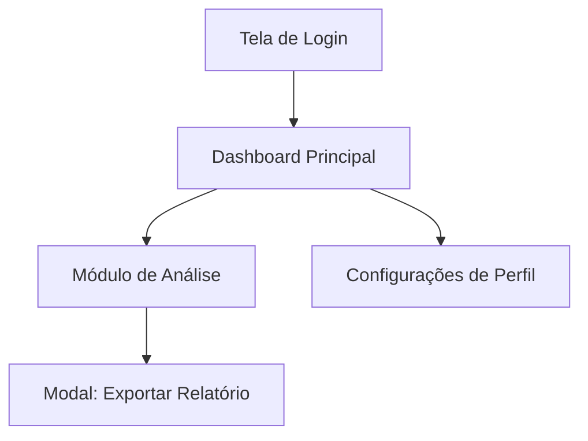

# Skill: Análise, Design e Implementação de Sistemas (`arquitetura-design-implementacao-sistema`)

## Gatilhos de Ativação
- Solicitações de arquitetura de software, aplicativos ou plataformas web.
- Pedidos para desenhar navegabilidade, jornadas de usuário, wireframes conceituais ou interfaces táteis.
- Criação de planos de implementação técnica, mapeamento de rotas de API e especificação funcional de produtos digitais.
- Demandas para alinhar sistemas ao Design System Tátil do Melki, com paleta mineral e auditoria de discrepâncias.

### Quando NÃO Usar
- Para auditoria isolada de repositório Git ou checagem exclusiva de `.gitignore` (utilize `auditoria-projetos-sistema`).
- Para execução de scripts operacionais de infraestrutura que não envolvam concepção de sistemas.
- Para aplicar mutações de código em lote sem aprovação explícita do desenvolvedor (Human-in-the-Loop).

---

## Entradas Obrigatórias
1. **Objetivo do Sistema:** O problema central que o software resolve e os resultados esperados.
2. **Perfis de Usuário:** Quem utilizará a plataforma e seus níveis de permissão.
3. **Escopo ou Funcionalidades Mínimas:** Recursos indispensáveis para a versão inicial (MVP).
4. **Arquétipo de Preferência (Opcional):** Arquétipo visual Melki pretendido (`tactile-matte`, `phantom-4k`, `luxury-deepblue`, `gilded-navy`, `polar-sand`). Padrão: `tactile-matte`.

---

## Diretrizes Canônicas de Design e Preferências Melki no Design de Sistemas

Toda arquitetura concebida por esta skill deve incorporar formalmente os 4 módulos canônicos abaixo:

### Módulo 1: Paleta de Cores do Sistema (Padrão Melki)
- **Tema Escuro (Dark Mode):**
  * Canvas de Fundo: Ardósia Grafite (`#0B101B` ou `#090B10`).
  * Superfície de Cartões e Painéis: Ardósia Escuro Elevado (`#162033` ou `#141B2D`).
  * Superfícies Flutuantes / Modais: (`#1E2B45`).
- **Tema Claro (Light Mode):**
  * Canvas de Fundo: Fundo Creme Suave (`#FDFEE9`, `#F8F7F2`) ou Polar Sand (`#EEF2F6`).
  * Cartões e Superfícies: Branco Puro (`#FFFFFF`) ou Primer Cinzento (`#E6E7E2`).
- **Acentos Minerais Autorizados:** Petroleum Blue (`#2B4C7E`), Slate Navy (`#203657`, `#4A5B73`), Royal Navy (`#042698`), Ouro Champanhe (`#D4AF37`), Sage Clínico (`#2D6A4F`) e Amber Matte (`#925C18`).
- ❌ **Banimento Anti-Cobalto:** É proibido prescrever tons de azul cobalto puro (`#0044FF`, `#233DFF`, `#1D4ED8`) ou cores fluorescentes que causem fadiga visual.

### Módulo 2: Diretrizes de Design Tátil e Especificação de Interface (Tactile Matte 4K)
- **Anti-Glassmorphism:** Proibido especificar vidros translúcidos com blur excessivo (`backdrop-filter: blur`), gradientes plásticos reflexivos ou caixas neon brilhantes.
- **Regra de Ouro da Profundidade:** No dark mode, os cartões devem ser estritamente mais claros que o canvas de fundo (`L_card > L_canvas`), assegurando a percepção de volume físico tridimensional.
- **Sistema de Sombras Multicamadas:** Elementos de UI elevados devem combinar sombra de contato curta (`0 2px 4px rgba(0, 0, 0, 0.4)`) com sombra difusa de projeção ampla (`0 10px 25px -4px rgba(0, 0, 0, 0.65)`).
- **Fio de Luz Superior Mineral (Rim Light):** Micro-chanfro óptico refletindo luz zenital (`border-top: 1px solid rgba(255, 255, 255, 0.14)` ou `inset 0 1px 0 rgba(255, 255, 255, 0.12)`).
- **Anti-Squish em Botões e Badges:** Obrigatoriedade de `flex-shrink: 0;` e `white-space: nowrap;` em botões de ação e tags para impedir quebras verticais de texto.
- **Ergonomia Cognitiva e Suporte a TDAH:** Busca rápida unificada (`Ctrl+K`), agrupamento semântico limpo em cartões individuais, ausência de bloqueios nativos do navegador (`alert()`) e feedback cinestésico tátil (`active:scale-95`).

### Módulo 3: Módulo de Opções e Preferências do Desenvolvedor
- **Consulta Estruturada via `ask_question`:** Em bifurcações de arquitetura, stack técnica ou layout, consultar o desenvolvedor com opções pré-configuradas e recomendação técnica fundamentada.
- **Arquétipos Canônicos Pré-Aprovados:** Oferecer os 5 arquétipos visuais oficiais (*Tactile Matte Minimalist*, *Phantom Obsidian 4K*, *Luxury Deep Blue*, *Gilded Navy Heritage*, *Polar Sand Light*).
- **Ecossistema Open Source Autorizado (Padrão shadcn/ui):** Priorizar arquitetura de frontend desacoplada com componentes de código aberto "copy-paste" (**shadcn/ui**, **Radix UI**, **Tailwind UI / Catalyst**, **Lucide Icons** e **Geist Design**), evitando dependências pesadas proprietárias.

### Módulo 4: Matriz de Detecção de Discrepâncias com as Preferências
- Checklist determinístico que valida o design do sistema contra as preferências perenes:
  * `[DISC-01: COR]` `[PASS / FAIL]`: Paleta mineral livre de azul cobalto e saturações neon.
  * `[DISC-02: DARK-LUM]` `[PASS / FAIL]`: Cartões no dark mode mais claros que o canvas de fundo.
  * `[DISC-03: SOMBRA]` `[PASS / FAIL]`: Presença de sombras físicas multicamadas calibradas.
  * `[DISC-04: RIM-LIGHT]` `[PASS / FAIL]`: Fio de luz superior zenital mineral especificado.
  * `[DISC-05: GLASS]` `[PASS / FAIL]`: Ausência de glassmorphism difuso ou reflexos sintéticos.
  * `[DISC-06: SQUISH]` `[PASS / FAIL]`: Botões e badges blindados com anti-squish.
  * `[DISC-07: TDAH-UX]` `[PASS / FAIL]`: Atalho rápido de busca (`Ctrl+K`) e modais sem bloqueio nativo.
  * `[DISC-08: SUPPLY]` `[PASS / FAIL]`: Adoção do modelo copy-paste (shadcn/ui) com zero caixas-pretas.

---

## Fluxo Passo a Passo com Decisões Condicionais

### Passo 1: Interpretação de Intenção, Regras de Negócio e Consulta de Opções
- Analise os requisitos do sistema. Se faltarem detalhes operacionais de baixo risco, assuma a interpretação mais útil e técnica. Se houver dúvidas de arquitetura ou estética visual, acione `ask_question` apresentando opções alinhadas aos arquétipos do Melki.

### Passo 2: Arquitetura de Navegabilidade e UX Tátil
- Monte a árvore de navegação completa.
- Mapeie a jornada do usuário do login/onboarding às ações de maior valor.
- Garanta que toda ação de saída redirecione para um estado válido e que haja atalho de comando rápido (`Ctrl+K`).

### Passo 3: Design de Funcionamento, Interface e Tokens Táteis
- Especifique a hierarquia visual de cada tela crítica com os tokens da paleta mineral (Módulo 1).
- Defina o comportamento dinâmico de componentes (botões com anti-squish, formulários com relevo tátil, tabelas com respiro).
- Especifique as fórmulas de elevação física multicamada e rim light (Módulo 2).
- Mapeie explicitamente os 4 estados de interface: *Loading*, *Success*, *Error* e *Empty State*.

### Passo 4: Plano de Implementação e Arquitetura Técnica
- Especifique as APIs e endpoints REST/GraphQL vinculados a cada tela.
- Defina a estrutura básica do modelo de dados (entidades, atributos e relacionamentos).
- Utilize componentes open source copy-paste do ecossistema shadcn/ui e Lucide Icons (Módulo 3).
- Organize a entrega em fases de desenvolvimento cronológicas.

### Passo 5: Auditoria de Discrepâncias e Fechamento
- Execute a Matriz de Detecção de Discrepâncias do Módulo 4 contra a especificação produzida.
- Assegure que nenhum ponto de atenção crítico ou desvio das preferências permaneça sem justificativa técnica.

---

## Decisões Condicionais
- **SE o sistema for focado em Front-End / UX:** Aprofunde o detalhamento da hierarquia de telas, componentes táteis reutilizáveis, sombras multicamadas e navegabilidade; reduza a especificação de infraestrutura de banco de dados.
- **SE o sistema for uma API / Back-End:** Inverta a prioridade para o modelo de dados, contratos de endpoints tipados, segurança e concorrência, mantendo a navegabilidade limitada ao fluxo de consumo de dados.

---

## Modelo de Saída

### 1. Visão Geral e Intenção Prática
* **Objetivo do Sistema:** [Resumo em 1-2 frases]
* **Público e Permissões:** [Lista de perfis de acesso]
* **Arquétipo Visual Melki Selecionado:** [Tactile Matte Minimalist / Outro]

### 2. Mapa de Navegabilidade (UX)

### 3. Especificação de Funcionamento e Interface Tátil

| Tela / Módulo | Componentes de UI | Tokens de Cor & Elevação | Funcionamento / Regra de Negócio | Estados de Interface |
| :--- | :--- | :--- | :--- | :--- |
| Ex: Dashboard | Gráfico de Vendas, Filtro Temporal, Botões Anti-Squish | Card `#162033` sobre Canvas `#0B101B`, `--elevation-card`, Rim Light | Atualizar métricas ao alterar o filtro; atalho `Ctrl+K` para busca | Empty, Loading, Success, Error |

### 4. Plano de Implementação Técnica
* **Fase 1 (MVP):** [Entregáveis das primeiras 2-4 semanas com componentes shadcn/ui]
* **Fase 2 (Escala):** [Recursos secundários, automações e otimizações]
* **Estrutura de Rotas / APIs:**
  * `POST /api/v1/auth/login` — Autenticação de usuário
  * `GET /api/v1/dashboard/metrics` — Recuperação de indicadores

### 5. Matriz de Discrepâncias com as Preferências e Checklist de Aceite

| Critério de Preferência | Status Determinístico | Evidência / Observação |
| :--- | :---: | :--- |
| **Paleta Mineral Anti-Cobalto** | `[PASS]` | Uso de Slate Navy e Petroleum Blue; zero azul cobalto |
| **Profundidade Dark Mode (Cards Lighter)** | `[PASS]` | Cartões `#162033` sobre canvas `#0B101B` |
| **Sombras Multicamadas + Rim Light** | `[PASS]` | Sombra oclusão + projeção e borda superior mineral |
| **Anti-Squish em Botões e Tags** | `[PASS]` | `flex-shrink: 0; white-space: nowrap;` em ações |
| **Ergonomia e Suporte a TDAH** | `[PASS]` | Atalho `Ctrl+K` e ausência de bloqueios nativos |
| **Componentes Modulares (shadcn/ui)** | `[PASS]` | Modelo copy-paste sem bibliotecas caixa-preta |

---

## Limites de Segurança
* Não expor senhas, credenciais reais ou dados sensíveis nos exemplos de código ou documentação.
* Exigir validação humana explícita antes de sugerir comandos de execução em ambientes ativos de desenvolvimento.
* Proibir arquiteturas que recomendem dependências vulneráveis ou pacotes não auditados.
