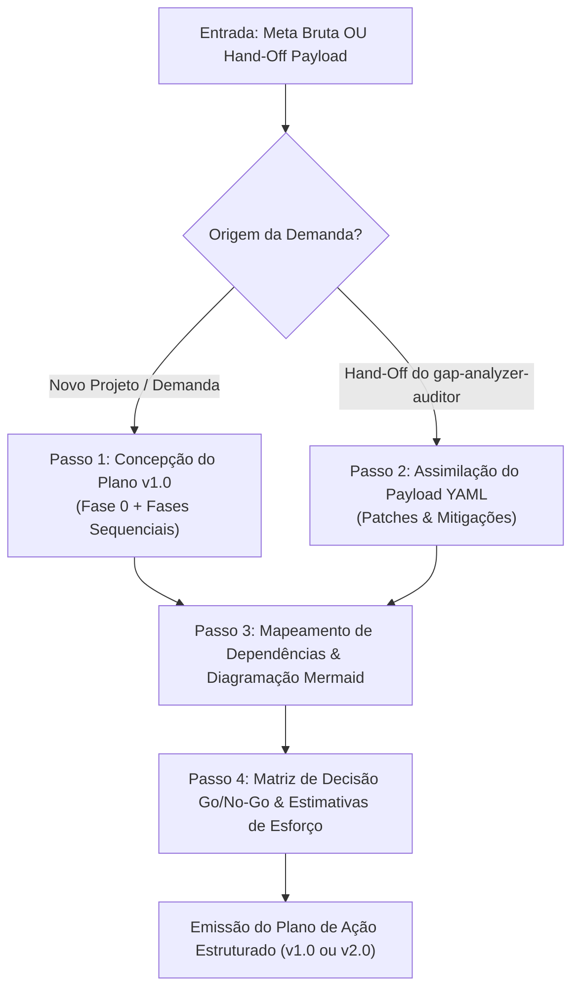
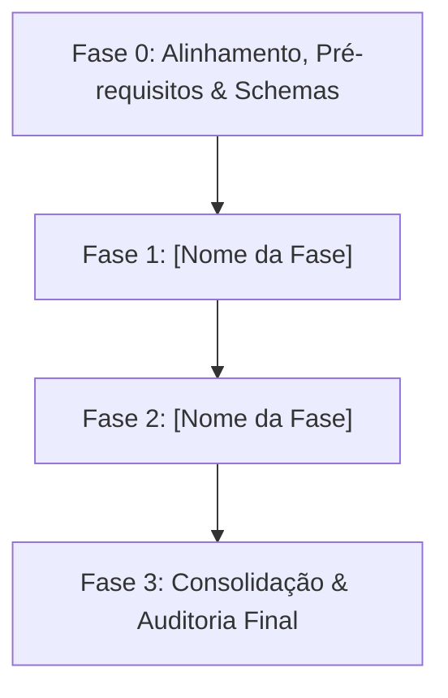

# SKILL: Planejador Estratégico de Contexto de Alto Nível (`high-level-context-planner` v2.0.0)

## 1. Identificação e Metadados
- **Nome Oficial**: `high-level-context-planner`
- **Identificador de Ativo**: `SKILL_HIGH_LEVEL_CONTEXT_PLANNER_V2`
- **Versão de Referência**: `2.0.0`
- **Compatibilidade Normativa**: Multi-LLM (Gemini 2.5+, Claude 3.5+, GPT-4o+, Google ADK, LangGraph, MCP Spec 2026-07-28).
- **Papel na Arquitetura**: Nó Planejador Estratégico em malha fechada (*Strategic Planner & State Graph Coordinator*).

---

## 2. Propósito e Missão (Quando Usar)

### Quando Usar
Esta skill **DEVE** ser acionada nas seguintes circunstâncias:
- Diante de solicitações complexas, épicos de desenvolvimento, migrações de sistemas ou demandas multifásicas que exigem decomposição arquitetural.
- Para gerar planos de trabalho executivos com fases numeradas, atribuição de agentes/skills, insumos, entregáveis e critérios de aceite Go/No-Go.
- Quando o `gap-analyzer-auditor` emitir um relatório de anomalia acompanhado de `Hand-off Payload (YAML)`, demandando a geração de um **Plano de Ação Corretivo Revisado (Plano v2.0)**.
- Para estruturar fluxos visuais em diagramas Mermaid claros (`flowchart TD`/`LR`), prevenindo dependências circulares e gargalos de contexto.
- Em pipelines orquestrados por `skill-orquestrador-planos-encadeados`, servindo como o motor formal de planejamento inicial e de contingência.

### Quando NÃO Usar
- Para tarefas simples de comando único ou scripts utilitários descartáveis sem transição de fases.
- Para executar ações diretas de mutação no disco, compilação ou chamadas destrutivas (a execução cabe aos executores ou subagentes operários).
- Para realizar auditoria e RCA isolado de falhas em tempo de execução (utilize `gap-analyzer-auditor`).
- Para tarefas que violem as políticas de menor privilégio ou exijam credenciais de infraestrutura não concedidas.

---

## 3. Entradas Obrigatórias e Parâmetros

1. **`strategic_goal`** (obrigatório): O objetivo final, briefing de projeto, requisitos funcionais ou demanda bruta do usuário.
2. **`handoff_payload`** (condicional): O bloco YAML estruturado emitido pelo `gap-analyzer-auditor` contendo `incident_id`, `recommended_option`, `required_adjustments` e `contingency_trigger` (obrigatório em ciclos de replanejamento).
3. **`available_skills_catalog`** (opcional): Catálogo de skills disponíveis no workspace para mapeamento de responsáveis.
4. **`operational_constraints`** (opcional): Prazos, orçamento de tokens, restrições de rede ou premissas técnicas específicas.

---

## 4. Diretrizes Canônicas de Design e Preferências Melki (Padrão Franklin 2026)

Sempre que o planejamento envolver entregas de interfaces, arquiteturas frontend, painéis de controle ou relatórios visuais, a skill embute os 4 módulos canônicos:

### Módulo 1: Paleta de Cores Canônica (Ardósia/Creme & Acentos Minerais)
- **Dark Mode**: Canvas Ardósia Grafite (`#0B101B`), Cartões Elevados (`#162033`) e divisores translúcidos (`rgba(255, 255, 255, 0.08)`).
- **Light Mode**: Canvas Creme Suave (`#FDFEE9`, `#F8F7F2`) ou Polar Sand (`#EEF2F6`) com Cartões em Branco Puro (`#FFFFFF`).
- **Acentos Minerais Autorizados**: Petroleum Blue (`#2B4C7E`), Slate Navy (`#203657`), Ouro Champanhe (`#D4AF37`), Sage Clínico (`#2D6A4F`) e Amber Matte (`#925C18`).
- ❌ **Banimento Anti-Cobalto**: Proibição terminante de azul cobalto puro (`#0044FF`, `#233DFF`, `#1D4ED8`) em wireframes, dashboards ou componentes propostos no plano.

### Módulo 2: Diretrizes de Design Tátil e Composição Visual (Tactile Matte 4K)
- **Anti-Glassmorphism**: Banimento de vidros translúcidos borrados (`backdrop-filter: blur`) e gradientes neon em interfaces planejadas.
- **Regra de Ouro da Profundidade**: Em planos de frontend, os cartões devem ser estritamente mais claros que o fundo (`L_card > L_canvas`).
- **Sombras Físicas e Rim Light**: Especificação mandatória de relevo tátil com micro-chanfro óptico zenital (`border-top: 1px solid rgba(255, 255, 255, 0.14)`).
- **Anti-Squish**: Requisito explícito de proteção anti-deformação em botões e badges (`flex-shrink: 0; white-space: nowrap;`).

### Módulo 3: Mapeamento de Opções das Preferências do Desenvolvedor
- **Prioridade para o Ecossistema shadcn/ui**: Todo plano envolvendo UI prioriza bibliotecas modulares "copy-paste" (**shadcn/ui**, **Radix UI**, **Lucide Icons**).
- **Bifurcações com `ask_question`**: Quando houver alternativas concorrentes de arquitetura, incluir paradas controladas com formulários de múltipla escolha.

### Módulo 4: Matriz de Detecção de Discrepâncias com as Preferências
- Checklist determinístico que governa as fases planejadas:
  * `[PASS / FAIL]` **Ausência de Cobalto Neon**: A esteira planejada veta azuis elétricos.
  * `[PASS / FAIL]` **Fase 0 Obrigatória**: Presença de alinhamento e pré-requisitos antes do código.
  * `[PASS / FAIL]` **Critérios Go/No-Go Falsificáveis**: Regras determinísticas de transição de fase.
  * `[PASS / FAIL]` **Prevenção de Sobre-Engenharia (KISS)**: Sem servidores mockados ou stacks web pesadas quando primitivas locais bastam.

---

## 5. Processamento Passo a Passo (Protocolo de Planejamento e Replanning)



### Passo 1: Concepção do Plano Inicial (v1.0)
1. Analisar a meta e isolar o escopo do projeto (regra anti-inchaço / MVP).
2. **Fase 0 Mandatória**: Toda esteira deve iniciar com a Fase 0 cobrindo:
   - Validação de pré-requisitos, schemas de dados, variáveis de ambiente e diretrizes de design.
   - Verificação de caminhos canônicos e catálogo de ferramentas.
3. Decompor os objetivos em fases numeradas (Fase 1, Fase 2, Fase 3...), cada uma contendo:
   - Objetivo específico da fase.
   - Skill / Agente responsável pela execução.
   - Insumos requeridos (inputs) e entregáveis esperados (outputs).
   - Critérios determinísticos de aceite (`[PASS]` / `[FAIL]`).
   - Estimativa de esforço relativo (Baixo / Médio / Alto).

### Passo 2: Assimilação do Hand-Off Payload e Replanning (v2.0)
1. Extrair os campos estruturados do payload YAML: `incident_id`, `recommended_option`, `required_adjustments` e `contingency_trigger`.
2. Para cada item em `required_adjustments`:
   - Ação `REFATORAR`: Ajustar pontualmente a instrução técnica da fase afetada.
   - Ação `INSERIR_GUARDRAIL`: Adicionar etapa de validação intermediária ou parada HITL.
   - Ação `REMOVER_DEPENDENCIA`: Desacoplar nós com dependência circular.
   - Ação `ADICIONAR_RETRY`: Configurar política de retentativa com backoff exponencial.
   - Ação `BLOQUEIO_HITL`: Congelar avanço automatizado exigindo confirmação explícita do desenvolvedor.
3. Emitir a versão atualizada do plano marcada formalmente como **Plano de Ação Revisado (v2.0)**.

### Passo 3: Mapeamento de Dependências e Diagramação Mermaid
Elaborar fluxograma visual claro em sintaxe `mermaid` (`flowchart TD` ou `LR`), com rótulos de nós entre aspas e sem tags HTML complexas.

### Passo 4: Matriz de Decisão Go/No-Go e Portão de Qualidade
Consolidar a tabela determinística de critérios de aprovação para cada fase, garantindo que falhas em fases antecedentes impeçam transições prematuras.

---

## 6. Saídas e Entregáveis (Modelo de Saída)

Toda entrega gerada por esta skill segue rigorosamente a estrutura canônica:

```markdown
# PLANO DE AÇÃO ESTRUTURADO: [NOME DO PROJETO / OBJETIVO]

> **Versão do Plano**: [v1.0.0 (Concepção Inicial) OU v2.0.0 (Revisão Pós-Auditoria)]  
> **Status de Execução**: [EM PLANEJAMENTO / PRONTO PARA EXECUÇÃO / REVISADO PÓS-HANDOFF]  
> **Orquestrador Alvo**: skill-orquestrador-planos-encadeados  

---

## 1. Síntese Executiva e Escopo
- **Objetivo Estratégico:** [Resumo claro do resultado esperado em 1 a 2 frases]
- **Origem do Disparo:** [Demanda Direta do Usuário OU Hand-off do gap-analyzer-auditor (ID: [INCIDENT_ID])]
- **Premissas e Restrições:** [Premissas adotadas e restrições de ambiente]

---

## 2. Diagrama de Fluxo Visual de Fases (Mermaid)


---

## 3. Decomposição Detalhada por Fases

### Fase 0: Alinhamento, Pré-requisitos e Schemas
- **Objetivo:** Garantir integridade de insumos, tokens de design tátil e ausência de dependências circulares.
- **Skill / Agente Responsável:** `skill-orquestrador-planos-encadeados`
- **Insumos:** [Arquivos, schemas JSON, credenciais requeridas]
- **Entregáveis:** [Ambiente validado, schemas compilados]
- **Critério Go/No-Go:** `[PASS]` Todos os pré-requisitos satisfeitos; `[FAIL]` Aborta com diagnóstico.
- **Esforço Estimado:** Baixo

### Fase 1: [Nome da Fase 1]
- **Objetivo:** [Meta técnica da fase]
- **Skill / Agente Responsável:** `[Nome da Skill]`
- **Insumos:** [Saídas da fase anterior]
- **Entregáveis:** [Arquivos gerados, testes validados]
- **Critério Go/No-Go:** [Critério booleano de aceite]
- **Esforço Estimado:** [Baixo / Médio / Alto]

[... Demais fases estruturadas ...]

---

## 4. Matriz de Decisão Go/No-Go e Portão de Qualidade
| Fase | Condição de Aprovação (Go) | Condição de Bloqueio (No-Go) | Rota de Contingência |
| :--- | :--- | :--- | :--- |
| **Fase 0** | Pré-requisitos e schemas OK | Insumos ausentes ou schemas inválidos | Solicitar insumos ao usuário |
| **Fase 1** | Entregável validado no terminal | Exit code != 0 ou quebra de schema | Acionar gap-analyzer-auditor |

---

## 5. Registro de Patches e Mitigações (Apenas para Planos v2.0+)
- **Incidente de Origem:** [AUDIT-DATA-SEQ]
- **Opção Adotada:** [Opção 1 Cirúrgica OU Opção 2 Arquitetural]
- **Ajustes Aplicados:**
  - *Etapa X:* [Descrição da refatoração realizada com base nas instruções de patch]
```

---

## 7. Exceções, Limites e Restrições Negativas (Guardrails)

- ❌ **Proibição de Pular a Fase 0**: Todo plano deve conter a Fase 0 de alinhamento e validação de schemas.
- ❌ **Proibição de Dependências Circulares**: É vedado gerar planos onde a Fase A dependa da Fase B e vice-versa.
- ❌ **Proibição de Execução Direta**: A skill não executa comandos destrutivos ou scripts; ela planeja e delega.
- ❌ **Proibição de Ignorar o Hand-Off Payload**: Quando acionada com um payload do `gap-analyzer-auditor`, todos os `required_adjustments` devem ser refletidos no novo plano.
