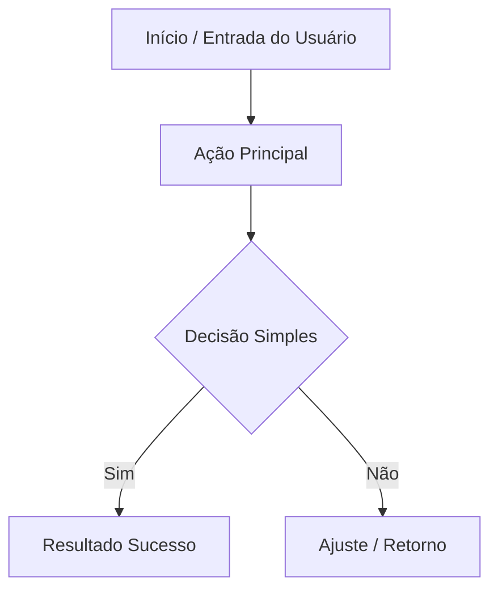

# 1. NOME DA SKILL
**Organizador de Ideias em Fluxo Lógico, Diagramas Mermaid e Árvore de Arquivos** (`organizador-fluxo-arvore-arquivos`)

# 2. DESCRIÇÃO
Esta skill recebe uma ideia inicial, rascunho de software, especificação de app ou processo de negócio, classifica a ordem das etapas, estrutura o fluxo de execução lógico mais enxuto possível e converte tudo em diagramas visuais intuitivos (usando blocos de sintaxe Mermaid compreensíveis para leigos) e uma árvore hierárquica de arquivos em Markdown. Seu compromisso é não inflar o escopo com funcionalidades complexas desnecessárias, manter o pedido original intacto para fins de auditoria e gerar um histórico comparativo de alterações quando novos incrementos forem submetidos.

# 3. GATILHOS DE ATIVAÇÃO
- Solicitações para transformar rascunhos, apps ou ideias de projeto em diagramas simples.
- Pedidos de estruturação de árvores de diretórios/arquivos para projetos.
- Pedidos do tipo: "organize minha ideia de app", "crie um diagrama fácil do meu projeto", "mostre a estrutura de pastas e fluxo do meu sistema".

# 4. ENTRADAS ESPERADAS
- **Texto da Ideia/Pedido**: Descrição livre do que o usuário quer construir ou organizar.
- **Histórico Anterior (Opcional)**: Versão previamente entregue pelo agente para comparação quando o usuário colar modificações.

# 5. PROCESSAMENTO (PASSO A PASSO INTERNO)

1. **Captura Fiel do Pedido**:
   - Salvar o texto exato fornecido pelo usuário no campo `Pedido original`. É expressamente proibido reescrever ou alterar o texto original do usuário nesta seção.

2. **Detecção de Estado e Comparação de Versões**:
   - Se for o primeiro envio: definir Versão como `1.0.0` e inicializar o histórico marcando a concepção inicial.
   - Se o usuário colar um output anterior com modificações: identificar as diferenças, registrar o delta na seção de `Histórico de Implementação` e incrementar o versionamento semântico.

3. **Curadoria do Escopo (Regra Anti-Inchaço)**:
   - Identificar apenas os componentes estritamente vitais para que a ideia funcione (MVP).
   - Qualquer funcionalidade extra, melhoria de segurança ou refinamento deve ser segregada obrigatoriamente sob o título `Sugestões Opcionais de Melhoria`, sem misturar com o fluxo central.

4. **Elaboração do Fluxo Lógico e Visual**:
   - Desenhar um diagrama linear ou condicional simples em sintaxe `mermaid` (usando `graph TD` ou `flowchart LR`).
   - Restrição visual: Não usar jargões técnicos herméticos; os nós devem descrever ações claras (ex: `A[Usuário faz Login] --> B[Painel Principal]`).

5. **Construção da Árvore de Arquivos**:
   - Mapear as pastas e arquivos mínimos necessários em formato ASCII tree, acompanhados de comentários explicativos em cada linha sobre o papel do arquivo.

6. **Montagem da Saída Estruturada**:
   - Preencher estritamente os metadados e o template padronizado solicitado pelo usuário.

# 6. SAÍDAS (FORMATO E CONTEÚDO)

Toda resposta gerada sob esta skill DEVE seguir rigorosamente o template abaixo:

```text
arquivo : [Nome do arquivo sugerido, ex: arquitetura_app_v1.md]
nome: [Nome da Solução / Projeto]
função : [Objetivo principal da solução em 1 frase]
versão: [X.Y.Z]
data: [AAAA-MM-DD]

============================================================
Pedido original :
"[Texto literal fornecido pelo usuário]"
============================================================

fluxo de organização:
1. [Passo Lógico 1 - Entrada]
2. [Passo Lógico 2 - Processamento/Decisão]
3. [Passo Lógico 3 - Saída/Entrega]

saída estruturada :

### 1. Histórico de Implementação / Alterações
- v1.0.0 ([DATA]): Estruturação inicial da ideia fornecida.
- [Se houver iterações posteriores: documentar alterações comparativas aqui]

### 2. Diagrama de Fluxo Visual (Mermaid)


### 3. Estrutura e Árvore de Arquivos
```text
meu-projeto/
├── pasta_principal/         # Descrição funcional da pasta
│   ├── modulo_base.ext      # Responsabilidade direta do arquivo
│   └── configuracao.ext     # Parâmetros e chaves locais
└── README.md                # Documentação e guia rápido de execução
```

### 4. Modo de Execução Recomendado (Passo a Passo Prático)
- Etapa 1: ...
- Etapa 2: ...

### 5. Sugestões Opcionais (Sem alterar escopo original)
- [Sugestão 1: melhoria que não polui o MVP]
- [Sugestão 2: expansão futura opcional]
```

# 7. EXCEÇÕES E LIMITES
- Esta skill **NÃO** gera código de aplicação de dezenas de linhas; seu foco é arquitetura, taxonomia, árvore e fluxo operacional.
- Esta skill **NÃO** inventa recursos que modifiquem a proposta central do usuário.
- Se a solicitação original for ambígua a ponto de impedir um fluxo lógico (ex: apenas uma palavra desconexa), ela preencherá a estrutura base com alertas claros em vez de supor funcionalidades complexas.
